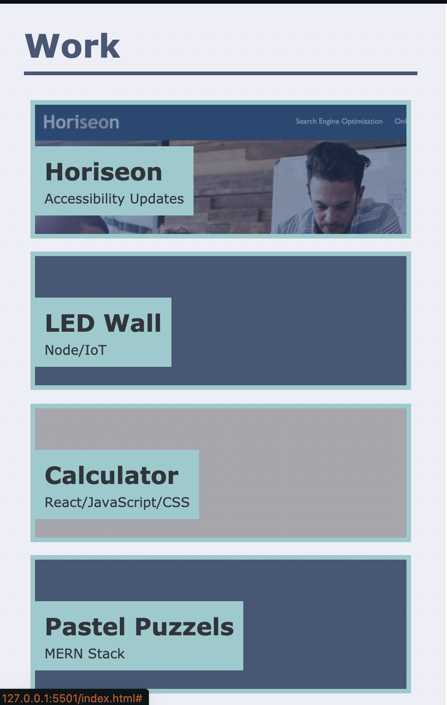

# Building a Personal Porfolio
The purpose of this porject is to form and begin buidling a personal portoflio showcasing one's works. 

## Advanced CSS

With the help of *flexbox*, *media queries*, and *CSS variables* I was able to get the page to remain fully functional despite being resized or viewed on different screens.

The different containers stacked up on top of each other nicely when resized to the smallest screen size possible 

### The Work Continues

At the moment the page is a work in progress. In the upcoming weeks, more project will be added. The layout is set to change as well due to new information being obtained.
