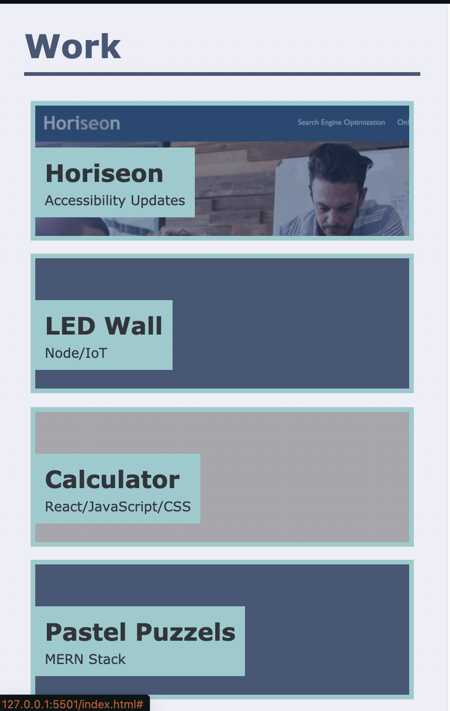
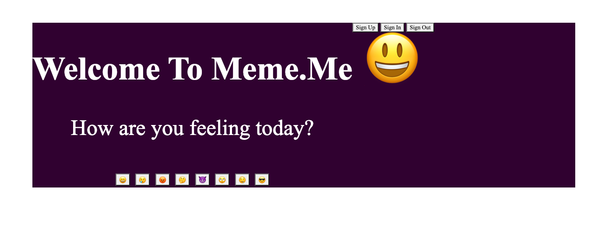
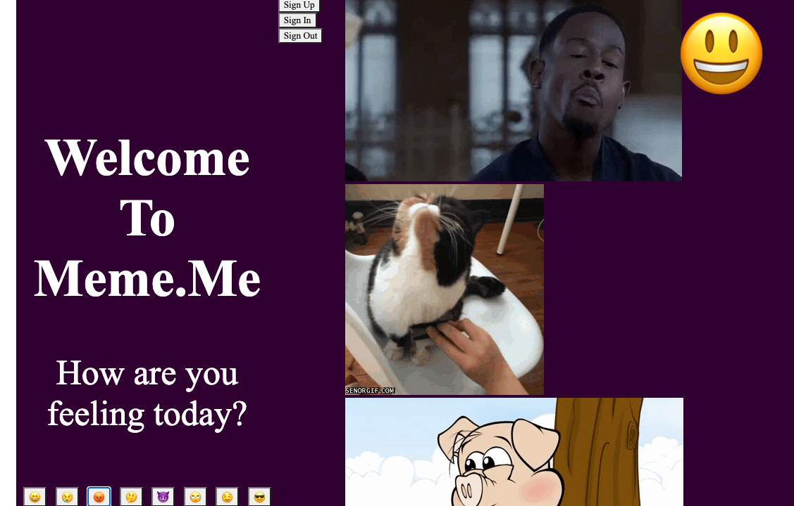

# Building a Personal Porfolio
The purpose of this project is to form and begin buidling a personal portoflio showcasing one's works. 

## Advanced CSS

With the help of *flexbox*, *media queries*, and *CSS variables* I was able to get the page to remain fully functional despite being resized or viewed on different screens.

The different containers stacked up on top of each other nicely when resized to the smallest screen size possible 

##Third Party API

With the help of a team consisting of Lisette, Ricahrd, Nahid and I, we created [Meme.me](https://w9os.github.io/meme.me/) . 

On our app you can click on any of the pre-selected emojis conveying how you're feeling today and you get a gif in return. The gif is loaded using the Giphy API. 

### The Work Continues

At the moment the page is a work in progress. In the upcoming weeks, more project will be added. The layout is set to change as well due to new information being obtained.
